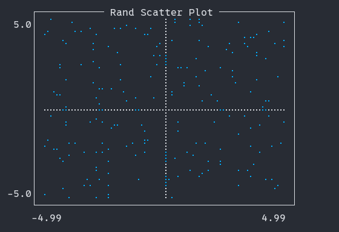
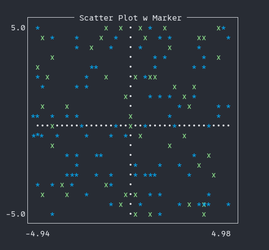
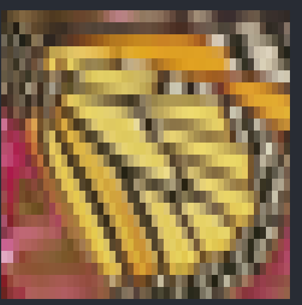

# UnicodePlots-py

Unicode plotting library designed for use in python.

> [!WARNING]
> Library is in development. Things will change by version and some features might be temporary.

# Supported backends

- [x] python
> Support for other backends will come very late
- [ ] numpy
- [ ] pytorch
- [ ] tinygrad

# Inference
> Note: Frontend components subject to significant changes

## Lineplot (Lineplot)
```python
Lineplot([-1, 2, 3, 7], [-1, 2, 9, 4], title="Example", name="my line", xlabel="x", ylabel="y", border='single').render()
```

```python
Lineplot(x_vals, math.sin, x_vals, math.cos,
    width = 80, height = 60,
    show_axes=True, border='single', xlabel='x',ylabel='f(x)').render()
```


## Scatterplot (Lineplot)
```python
Lineplot(x, y, scatter=True, border = 'single', title="Rand Scatter Plot", show_axes=True).render()
```


## Marker (Lineplot)
```python
Lineplot(x, y, x1, y1, width = 40, height=20, scatter=True, border="single", marker = ['*', 'x'], title="Scatter Plot w Marker", show_axes=True).render()
```


## imageplot (Imageplot)
>If your terminal supports the kitty graphics protocol, you may need to set the environment variable ASCII=1
```python
Imageplot("media/monarch.png").render()
```

## It also support kitty image protocol

### To come
> stairs (Staircase Plot) \
> barplot (Bar Plot - horizontal) \
> histogram (Histogram - horizontal / vertical) \
> boxplot (Box Plot - horizontal) \
> densityplot (Density Plot) \
> contourplot (Contour Plot) \
> heatmap (Heatmap Plot) \


# Documentation
> TODO

## Installation

```bash
uv pip install git+https://github.com/GalaxAI/unicodeplot-py.git
```

## Saving figures
> To implement ...

## Things to do
- [ ] Add tests
- [ ] Add more plots
- [ ] Add more canvas types
- [ ] Different backends
    - User should be able to put torch.tensors np.arrays and tiny.tensors as numeric values or even Callables.

## Things to explore for future
- [ ] Interactive plots
    - Allow user to zoom in/out plot and move on x & y axis
- [ ] 3D plots
- [ ] Dynamicly update plot, so it could be used for ML training

# Contributing

Thank you for your interest in contributing to this project! I welcome all suggestions and improvements.

## How to Contribute

1. **Make your changes** - fix bugs, add features, or improve documentation
1. **Test your changes** to ensure they work as expected
1. **Submit a pull request** with a clear description of your changes

## Contribution Guidelines
- Add tests for new functionality when possible

If you have any questions or would like to discuss potential improvements, feel free to:
- Open an issue
- Create a pull request
- Contact me directly

# Acknowledgement

Inspired by [UnicodePlots.jl](https://github.com/Evizero/UnicodePlots.jl) and motivated by [Q](https://x.com/qtnx_)

# License
This code is free to use under the terms of the MIT license.
